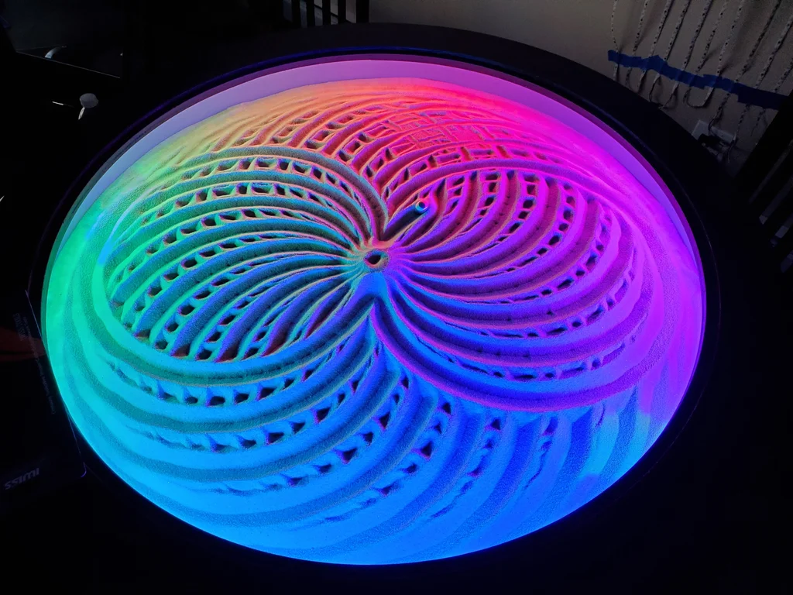

# The Sand Table
## Making Intelligent Things CS-358
This repository contains the 3D files and the code to create the sand table.

## How to
You can find the instructions to construct your own table and the software to control it in [our report](MIT___Sand_Table_Report.pdf).

